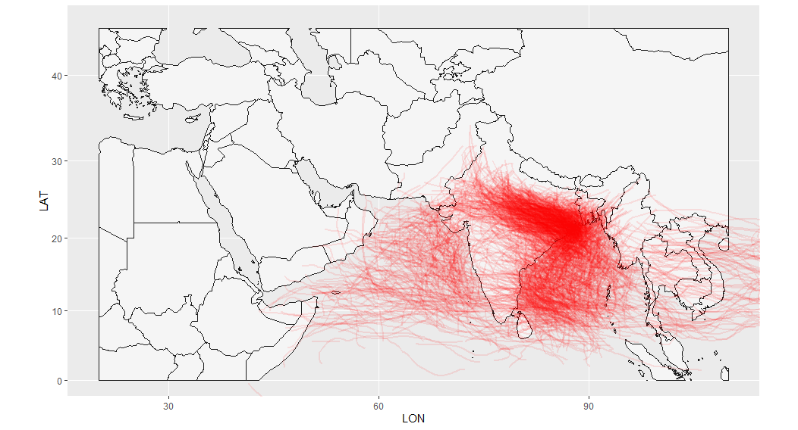

# NOAA Storms wrapper

Get NOAA IBTrack data ready to use in R.

The National Oceanic and Atmospheric Administration, which releases datasets known as [International Best Track Archive for Climate Stewardship](https://www.ncdc.noaa.gov/ibtracs/).

# Installing

```r
library(devtools)
install_github("bryceschultz/noaastorms")
library(noaastorms)
install.packages("dplyr")
```

## Available functions

`getStorms`: Fetch NOAA historical best track storms data

```r
> df <- getStorms(c('EP'))
> df2 <- getStorms(c('EP', 'SP'),
                   dateRange = c(as.Date('2010-01-01'), as.Date('2012-01-01')))

> head(df[1:5])
     Serial_Num Season Num Basin Sub_basin    Name
2 1902276N14266   1902  01    EP        MM UNNAMED
3 1902276N14266   1902  01    EP        MM UNNAMED
4 1902276N14266   1902  01    EP        MM UNNAMED
5 1902276N14266   1902  01    EP        MM UNNAMED
6 1902276N14266   1902  01    EP        MM UNNAMED
```

**Argument**: A vector of basin codes from the list:
  - NA: North Atlantic
  - SA: South Atlantic
  - NI: North Indian
  - SI: South Indian
  - EP: East Pacific
  - SP: South Pacific
  - WP: West Pacific
  
**Argument**: A vector of two dates. Storms dated outside of this date range will be filtered out.

## Usage

```r
# load a map of the world and `clipPolys` it to avoid issues when zooming in with `coord_map`
wm <- map_data("world")
library("PBSmapping")
data.table::setnames(wm, c("X","Y","PID","POS","region","subregion"))
worldmap = clipPolys(wm, xlim=c(20,110),ylim=c(0, 45), keepExtra=TRUE)

# load storms for North Indian ocean
spStorms <- getStorms(c('NA', 'SA'))

ggplot(spStorms, aes(x = LON, y = LAT, group = SID)) + 
  geom_polygon(data = worldmap, aes(x = X, y = Y, group = PID), 
               fill = "whitesmoke", colour = "gray10", size = 0.2) +
  geom_path(alpha = 0.1, size = 0.8,
            color = "red") +
  coord_map(xlim = c(20,110), ylim = c(0, 45)) 
```



## Notes

This package uses IBTrACS data v4.0, released from March 2019.

For a complete description of the changes in v4.0, [read the official NOAA changelog](https://www.ncdc.noaa.gov/ibtracs/index.php?name=status).
